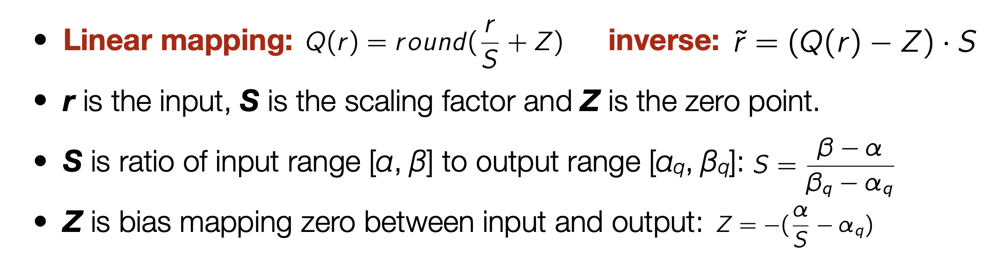

# Lab 3: Quantization

In this lab, you will understand what goes on under the hood of quantization (by doing some of the math and implementing quantization from scratch) and then experiment with quantizing your project's model!

The main goals of this exercise are: 
 1. Deeply undestand quantization and the errors associated with quantization
 2. Practical implementation use of quantization for your project
 3. Understand the performance-efficiency tradeoffs when using different levels of quantization

**DUE DATE: Nov 1, 2024**

## [2 points] Exercise 1: Implement Quantization from Scratch

Now, we will implement quantization of PyTorch Tensors.

```python
! pip install torch torchvision torchaudio
```


### 1. Calculate Scale and Zero Point for a single Tensor.
In this section, implement affine quantization as described in Lecture 6 where we will be quantizing from  `torch.Tensor` in `float32` to 8-bit `uint8 torch.Tensors`.



First implement a function which calculates the float `scale` and int `zeropoint` values. Include the following snippet of your function implementation in your report


```python
import torch
from typing import Tuple

def _calculate_scale_and_zeropoint(
    min_val: float, max_val: float, num_bits: int) -> Tuple[float, int]:
    raise NotImplementedError()

```


### 2. Quantization and Dequantization

1. Implement quantization to convert a `torch.fp32` Tensor to unsigned `torch.uint8`.
2. Implement dequantization to convert the `torch.uint8` tensor to `torch.fp32`.

Include the implementations of the 2 functions below (They should both be 1-2 lines of code only!)

```python
def quantize(x: torch.Tensor, scale: float, zero_point: int, dtype=torch.uint8):
   raise NotImplementedError()

def dequantize(x: torch.Tensor, scale: float, zero_point: int):
    raise NotImplementedError()
```

### 3. Validate the Implementation
Now run your quantization implementation, the dequantized values from your implementation should exactly match the test cases given below.

Hint: If you observe a small difference in the dequantized values, consider what happens to values when rounding or the effects of limited dynamic range of the `uint8` datatype.


```python
from copy import deepcopy

def test_case_0():
  torch.manual_seed(999)
  test_input = torch.randn((4,4))

  min_val, max_val = torch.min(test_input), torch.max(test_input)
  scale, zero_point = _calculate_scale_and_zeropoint(min_val, max_val, 8)

  your_quant = quantize(test_input, scale, zero_point)
  your_dequant = dequantize(your_quant, scale, zero_point)

  test_case_0 = torch.Tensor([
      [-0.2623,  1.3991,  0.2842,  1.0275],
      [-0.9838, -3.4104,  1.4866,  0.2405],
      [ 1.4866, -0.3716,  0.0874,  2.1424],
      [ 0.6340, -1.1587, -0.7870,  0.0656]])

  assert torch.allclose(your_dequant, test_case_0, atol=1e-4)
  assert torch.allclose(your_dequant, test_input, atol=5e-2)

  return test_input, your_dequant, your_quant


### Test Case 1
def test_case_1():
  torch.manual_seed(999)
  test_input = torch.randn((8,8))

  min_val, max_val = torch.min(test_input), torch.max(test_input)
  scale, zero_point = _calculate_scale_and_zeropoint(min_val, max_val, 8)

  your_quant = quantize(test_input, scale, zero_point)
  your_dequant = dequantize(your_quant, scale, zero_point)

  test_case_1 = torch.Tensor(
      [[-0.2623,  1.3991,  0.2842,  1.0275, -0.9838, -3.4104,  1.4866,  0.2405],
      [ 1.4866, -0.3716,  0.0874,  2.1424,  0.6340, -1.1587, -0.7870,  0.0656],
      [ 0.0000, -0.6558, -1.0056,  0.3061,  0.6340, -1.0931, -1.6178,  1.5740],
      [-1.7927,  0.6121, -0.7214,  0.6121,  0.3279, -1.5959, -0.5247,  0.3498],
      [-1.3773,  1.1149, -0.7870,  0.2842,  0.9182, -1.1805, -0.7433, -1.5522],
      [ 1.0056, -0.1093,  1.3991, -0.9182, -1.1805, -0.6777, -0.3061,  0.9838],
      [ 0.2186,  1.6396,  1.0712,  1.7489,  0.0874,  0.3498,  0.9838,  1.2024],
      [-0.3935, -0.6340,  1.9238,  1.2898,  0.0219,  0.3935,  1.4866, -0.9401]])

  assert torch.allclose(your_dequant, test_case_1, atol=1e-4)
  assert torch.allclose(your_dequant, test_input, atol=5e-2)

  return test_input, your_dequant, your_quant
```

1. Empirically, report the average and maximum quantization error?
3. Save the original fp32 tensor and quantized tensor to disk with `torch.save`. Report the difference in disk utilization in a table similar to the one below.
   
| File  | Size (Byte) |
| --------------- | ----- |
| tensor_fp32_0   |  |
| tensor_quant_0  | |
| tensor_fp32_1   | |
| tensor_quant_1  | |


## [3 points] Exercise 2: MNIST and SST
We will now examine the effects of quantization on model compression. You will be looking at how three properties vary as a result of model quantization:
1. Model size (in memory)
2. Model accuracy
3. Model latency (small vs large batch)

The techniques we are exploring are:
1. Dynamic Quantization
2. Static Quantization
3. Quantization Aware Training

Values in our models will be quantized from `float32` to `qint8`.
Due to hardware differences, several of the results in this lab are unlikely to directly transfer to others' settings.

NOTE: We recommend running this part of the lab in Google Colab to avoid installation problems with the [torch.ao](https://github.com/pytorch/ao) package we will be using. If you choose to run this locally, ensure you have Pytorch 2.4+ and torchao installed. If you choose to use Google Colab you can train on the GPU but the inference **must still be performed after moving the model to CPU**

Data, Models and Evaluation
----
Data, models and evaluation for this part of the assignment will build off the code you wrote for Lab 1 and Lab 2. You are encouraged (and expected) to re-use model and evaluation code from Labs 1 and 2 to complete this assignment. In particular, you may find the following components of your Labs 1/2 useful:
- Preprocessing code for MNIST or SST-2
- Model class definition
- Parameter count and latency timing code
- Training and evaluation code
  - You will run inference many more times than training during this lab, so the evaluation function is especially important. If you have not already, you may wish to integrate latency measurement functionality in your evaluation function. An example eval function might take in a model and dataloader and return both accuracy and total time used for inference.

**Models:**
For the models in this assignment you will experiment with variants of the feed-forward networks with ReLU activations that you implemented in Lab 1. You will again experiment with a computer vision model trained on MNIST, OR a text sentiment analysis model trained on SST-2. You should only train **one** model, corresponding to your Lab 1 MNIST/SST-2 model, except with hyperparameters defined as below.

Here are the model and training hyperparameters you should use for the Lab 3 MNIST/SST-2 models:

| hyperparameter  | MNIST | SST-2 |
| --------------- | ----- | ----- |
| learning rate   | 0.001 | 0.001 |
| batch size      | 64    | 64    |
| hidden size     | 1024  | 256   |
| # hidden layers | 2     | 3     |
| training epochs | 2     | 2     |

You should also crop the input to 20x20 pixels at the center of the image.
Train and report its accuracy on the MNIST test set.
You should be able to get around 95% accuracy.

For SST, you should threshold your vocabulary to the 5000 most frequent words in the vocabulary.
Train this model and report its accuracy on the SST development set. You should be able to get about 80% accuracy.

**Evaluation:**

In this lab you will be evaluating models in terms of model size and inference latency. For inference latency report the average
**inference** time and standard deviation measured over 5 runs. For model size, you should report both parameter counts (using your Lab 1 code) and size on disk (in MB), which can be measured using this function:

```sh
import os

def print_size_of_model(model, label=""):
    torch.save(model.state_dict(), "temp.p")
    size=os.path.getsize("temp.p")
    print("model: ",label,' \t','Size (MB):', size/1e6)
    os.remove('temp.p')
    return size
```

Evaluate and report the inference latency of the model for batch sizes 1 and 64.
Report the size of the model.
This provides your baseline for comparison to quantization.

### Dynamic quantization in PyTorch  
----
First, you will apply dynamic quantization to your model using [quantize_dynamic](https://pytorch.org/docs/stable/generated/torch.ao.quantization.quantize_dynamic.html#torch.ao.quantization.quantize_dynamic). You may find the [PyTorch quantization tutorial](https://pytorch.org/tutorials/recipes/recipes/dynamic_quantization.html) helpful.

Quantize to `qint8` precision only, and report your results.


### Static quantization in PyTorch
----
Next, you'll perform static quantization using [prepare_fx](https://pytorch.org/docs/stable/generated/torch.ao.quantization.quantize_fx.prepare_fx.html) from [torch.ao.quantization](https://pytorch.org/docs/stable/quantization-support.html). After preparing, you can calibrate it with the test data itself for the purposes of this assignment.

### Quantization Aware Training in PyTorch
---
Finally, perform QAT using [prepare_qat_fx](https://pytorch.org/docs/stable/generated/torch.ao.quantization.quantize_fx.prepare_qat_fx.html#prepare-qat-fx) from [torch.ao.quantization](https://pytorch.org/docs/stable/quantization-support.html). After preparing the model, train the model with a train loop similar to Lab1 and seen in the Pytorch documentation.

Note: For both Static and QAT do not forget to either use [convert_fx](https://pytorch.org/docs/stable/generated/torch.ao.quantization.quantize_fx.convert_fx.html) or move the model to CPU and switch to eval mode before performing inference!

**REPORT:**
Report the numbers for all settings in the table below:

| Task | Quantization  | dtype     | Size (MB) | (Params) | Accuracy | Latency B1 | B64 |
| ----- | -- | -----     | ---- | -------- | -------- | ---------- | --- |
| MNIST/SST | Baseline | `float32` |      |          |            |     |      |
| MNIST/SST | Dynamic  | `qint8`   |      |          |            |     |      |
| MNIST/SST | Static  | `qint8`   |     |         |           |    |     |
| MNIST/SST | QAT  | `qint8`   |     |         |           |    |     |


## [4.5 points] Exercise 3: Quantize Your Class Project

### A. Reporting preliminaries

Briefly but clearly describe your project, including:
- hardware specs (along with OS and relevant software/tooling)
- model
- data

### [0.5 point] B. Discussing quantization with respect to your project

Take a look at [PyTorch's Introduction to Quantization](https://pytorch.org/blog/introduction-to-quantization-on-pytorch/#choosing-an-approach) and describe how quantization can be incorporated into your project. Briefly justify the type of quantization you plan to use, anchored in the model, hardware, details provided above in ~ 3 sentences.

### [2 points] C. Quantizing your model, on your device

Apply a form of quantization, across at least **two** different precisions, to the model you are planning to use for your course project, on the target device. You do not have to quantize in PyTorch, i.e if your hardware/platform's runtime or execution engine supports quantization you can use that as well.

1. Report numbers in the table below.
2. If you were unable to quantize your model, discuss sources of difficulty and challenges in implementation or deployment. *Note: This situation will be rare and requires detailed technical justification.*

  
| Precision      | Model Size (MB/GB) | Accuracy (%) | Inference Latency (ms/s) |
| -------------- | --------------- | ------------ | ---------------------- |
|  Non-quantized precision     |                 |              |                        |
| `precision 1`  |                 |              |                        |
| `precision 2`  |                 |              |                        |
| `precision 3` (optional) |      |      |      |


### **Discussion:**

#### [1 point] Observations
Describe and discuss your observations, reported in the table that you  generated in Exercise 3.
You might analyze differences across quantization precisions, differences in memory or latency etc.
Choose **two** axes of interest and discuss each in detail.

#### [1 point] Future work
Based on the results and observation, **pose a follow-up question related to this observation** (a research question or hypothesis) that is unanswered by the work in this assignment,
and;
**Describe in detail an experiment of set of experiments that you might perform** in order to answer that question. You do not need to run the experiments, just describe how you might go about answering or at least helping to elicidate an answer to the question.


Contributions [0.5 points]
----

Write down each team member's contributions to this lab by filling out the table below.

| Team Member | Contributions |
|-------------|---------------|
| Member 1    |               |
| Member 2    |               |
| Member 3    |               |
| Member 4    |               |


## Extra Credit:
This assignment includes two opportunities for extra credit.

### 1. Benchmarking mixed precision training [1 point]
Add an additional comparison to your results table using [automatic mixed precision training](https://pytorch.org/tutorials/recipes/recipes/amp_recipe.html).
This requires access to appropriate hardware that supports mixed-precision training (either a personal or lab GPU or via Colab).

This should add 4 lines to your table: one for each model and dataset. You don't need to use the same hardware here as above, just clearly specify either way.

### 2. Module-by-module sensitivity analysis [1 point]
[Start here](https://pytorch.org/blog/quantization-in-practice/#sensitivity-analysis).
1. Analyze accuracy and inference time in both Lab 2 models from quantizing just one module or layer at a time. Your results will depend in part on the structure of your model; looping through the `named_modules` as in the documentation code will include modules as well as "leaf" layers.
2. Analyze accuracy and inference time in both Lab 2 models from quantizing *all but one* layer at a time. *Hint: you should loop through only modules that do not have child modules themselves*

## Grading and submission (10 points + 2 extra credit)
----
Submit your answers to all the above questions to Canvas as a write-up in pdf format. This assignment is worth 10 points
(or 10% of your final grade for the class) with a total possible points of 12.5 with extra credit
